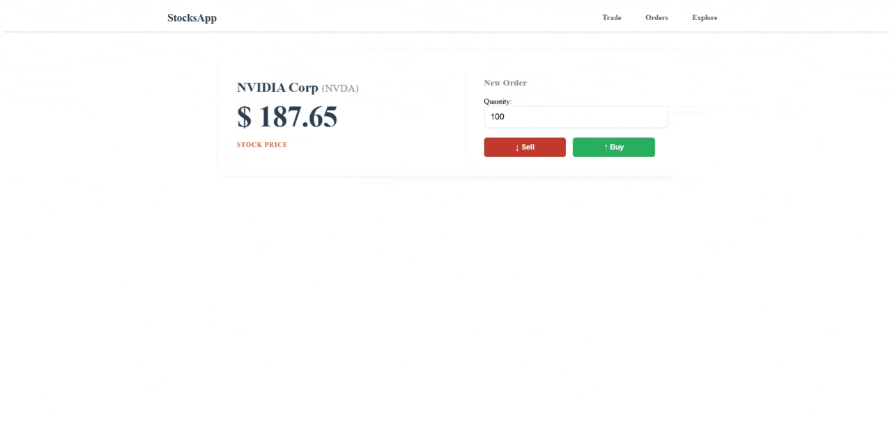

# 📈 StocksApp

Aplicação Web FullStack para **simulação de trade de ações** com cotações em tempo real, desenvolvida com ASP.NET Core MVC seguindo Clean Architecture.

> C# · ASP.NET Core MVC · Entity Framework Core · SQL Server · Finnhub API · WebSocket · Serilog · xUnit · Moq

---

## 🎬 Demonstração

> 

---

## ✨ Funcionalidades

- 📊 **Cotações em tempo real** via WebSocket integrado à API da Finnhub, atualizado diretamente na interface sem refresh de página
- 🔍 **Explorar ações** — lista das 25 ações mais populares do mercado americano com busca por símbolo
- 🛒 **Compra e venda de ações** — criação de ordens com validação no servidor e no cliente
- 📋 **Histórico de ordens** — visualização de todas as ordens de compra e venda realizadas, salvas em banco de dados
- 📄 **Exportação em PDF** — geração de relatório das ordens via Rotativa (wkhtmltopdf)
- 📝 **Logging estruturado** com Serilog (Console, SQL Server e Seq)
- 🛡️ **Middleware de exceções** com log centralizado de erros

---

## 🏗️ Arquitetura

O projeto segue **Clean Architecture** com separação em 3 camadas independentes:

```
StocksApp/
├── src/
│   ├── StocksApp.Core/                  # Camada de domínio e negócio
│   │   ├── Domain/Entities/             # BuyOrder, SellOrder
│   │   ├── Domain/RepositoryContracts/  # IFinnhubRepository, IStocksRepository
│   │   ├── ServiceContracts/            # Interfaces dos serviços
│   │   ├── Services/                    # FinnhubGetterService, StocksCreateService...
│   │   ├── DTO/                         # BuyOrderRequest/Response, SellOrderRequest/Response
│   │   ├── Extensions/                  # Mapeamentos entre entidades e DTOs
│   │   └── CustomValidators/            # MinimumDateAttribute
│   │
│   ├── StocksApp.Infrastructure/        # Camada de infraestrutura
│   │   ├── Repositories/                # FinnhubRepository, StocksRepository
│   │   └── DbContext/                   # ApplicationDbContext (EF Core)
│   │
│   └── StocksApp.UI/                    # Camada de apresentação (MVC)
│       ├── Controllers/                 # TradeController, StocksController
│       ├── Views/                       # Razor Views (Trade, Stocks, Shared)
│       ├── Filters/ActionFilters/       # CreateOrderActionFilter
│       ├── Middleware/                  # ExceptionHandlingMiddleware
│       ├── ViewComponents/              # SelectedStockViewComponent
│       └── ViewModels/                  # StockTrade, Orders, Stock
│
└── tests/
    ├── StocksApp.ServiceTests/          # Testes unitários dos serviços
    ├── StocksApp.ControllerTests/       # Testes unitários dos controllers
    └── StocksApp.IntegrationTests/      # Testes de integração (WebApplicationFactory)
```

**Padrões e práticas aplicados:**
- Clean Architecture (Core → Infrastructure → UI, sem dependências invertidas)
- Repository Pattern (desacoplamento entre serviços e acesso a dados)
- Injeção de Dependência nativa do ASP.NET Core
- DTOs para trafegar dados entre camadas sem expor entidades
- Extension Methods para mapeamento entre entidades e DTOs
- Action Filters para centralizar lógica de validação de formulários

---

## 🛠️ Tecnologias

| Camada | Tecnologia |
|---|---|
| Backend | ASP.NET Core MVC |
| Linguagem | C# |
| ORM | Entity Framework Core |
| Banco de dados | SQL Server (LocalDB em desenvolvimento) |
| API Externa | Finnhub REST + WebSocket |
| Logging | Serilog (Console, SQL Server, Seq) |
| PDF | Rotativa (wkhtmltopdf) |
| Frontend | Razor Views · CSS · JavaScript |
| Testes | xUnit · Moq · AutoFixture · FluentAssertions |

---

## 🚀 Como Executar Localmente

### Pré-requisitos

- [.NET SDK](https://dotnet.microsoft.com/download)
- [SQL Server LocalDB](https://learn.microsoft.com/en-us/sql/database-engine/configure-windows/sql-server-express-localdb) (geralmente incluído no Visual Studio)
- Conta gratuita na [Finnhub](https://finnhub.io/) para obter a API Key

### 1. Clone o repositório

```bash
git clone https://github.com/oJotaaa/StocksApp.git
cd StocksApp
```

### 2. Configure a API Key da Finnhub

Use [user-secrets](https://learn.microsoft.com/en-us/aspnet/core/security/app-secrets) para não expor a chave no código:

```bash
cd src/StocksApp.UI
dotnet user-secrets set "apiKey" "SUA_API_KEY_AQUI"
```

> ⚠️ Nunca adicione a API Key diretamente no `appsettings.json` e suba para o repositório.

### 3. Aplique as migrations do banco de dados

```bash
dotnet ef database update
```

### 4. Execute a aplicação

```bash
dotnet run
```

Acesse em: `https://localhost:5001`

---

## 🧪 Testes

O projeto possui **3 projetos de teste** independentes:

```bash
# Executar todos os testes
dotnet test
```

| Projeto | Escopo | Ferramentas |
|---|---|---|
| `ServiceTests` | Lógica de negócio (criar/buscar ordens, validações de limites) | xUnit · Moq · AutoFixture · FluentAssertions |
| `ControllerTests` | Comportamento dos controllers MVC | xUnit · Moq · AutoFixture · FluentAssertions |
| `IntegrationTests` | Fluxo HTTP ponta a ponta | xUnit · WebApplicationFactory |

Os testes de serviço utilizam **Moq** para isolar o repositório, garantindo que a lógica de negócio seja testada sem dependência de banco de dados.

---

## 📡 Integração com a Finnhub API

A aplicação consome dois tipos de endpoint da [Finnhub](https://finnhub.io/docs/api):

**REST — chamadas feitas no servidor (via HttpClient):**
- `GET /stock/profile2` — perfil e dados da empresa
- `GET /quote` — cotação atual da ação
- `GET /stock/symbol` — lista de ações disponíveis na bolsa americana
- `GET /search` — busca de ações por símbolo

**WebSocket — conexão feita no cliente (via JavaScript):**
- `wss://ws.finnhub.io` — stream de preços em tempo real, atualiza o preço exibido na tela sem precisar recarregar a página

---

## 💡 Decisões Técnicas

**Por que Clean Architecture?**
Permite trocar a infraestrutura (banco de dados, API externa) sem tocar na lógica de negócio. Os testes unitários dos serviços, por exemplo, mocam o repositório e rodam sem banco de dados real.

**Por que Repository Pattern?**
Desacopla os serviços do Entity Framework Core diretamente. Se o banco de dados mudar, apenas os repositórios precisam ser alterados.

**Action Filter para validação de ordens:**
Em vez de repetir o mesmo bloco de verificação de `ModelState` em `BuyOrder` e `SellOrder`, o `CreateOrderActionFilter` centraliza essa lógica e redireciona o usuário para a view com os erros automaticamente.

**Serilog com múltiplos sinks:**
Logs são enviados simultaneamente para Console, SQL Server e Seq, permitindo rastrear requisições e erros em diferentes níveis de observabilidade.

---

## 📌 Melhorias Futuras

- [ ] Autenticação de usuários com ASP.NET Core Identity
- [ ] Gráficos históricos de preços
- [ ] Deploy em cloud (Azure App Service + Azure SQL)

---

## 👤 Autor

Feito por **João Felipe Fernandes Pimentel** — [GitHub](https://github.com/oJotaaa)
